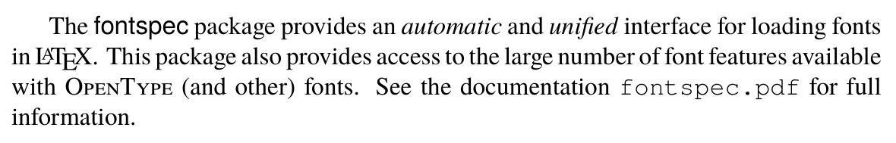
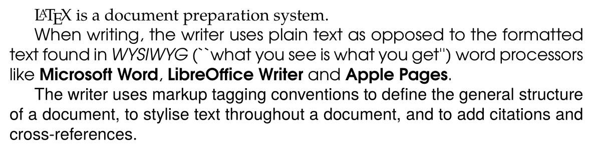
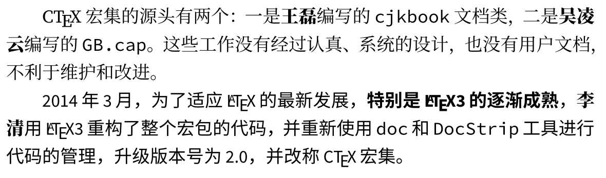

## 介绍

现代 TeX 引擎（包括 XeTeX、LuaTeX 和 [ApTeX](https://github.com/clerkma/ptex-ng)）已经全面支持使用 OpenType 字体，因而可以很方便地实现类似 Microsoft Word、Adobe Indesign 等软件的效果。

OpenType 字体格式由微软和 Adobe 联合开发，它有以下特点：

- 字体编码基于 Unicode
- 描述字体轮廓时，既可以用三次 [Bézier 曲线](https://en.wikipedia.org/wiki/B%C3%A9zier_curve)（PostScript 轮廓），也可以用二次 Bézier 曲线（TrueType 轮廓）
- 支持合字（也叫连字，ligature）、小型大写字母（small caps）、多种数字样式、上下标、上下文替换等高级字体排印功能，并可用于复杂语言排版
- 在 Windows、macOS、Linux 等多种平台下均可使用

OpenType 字体的文件扩展名可为 `.otf`、`.ttf`、`.ttc`，它们的区别如下：

- `.otf`：单个字体，使用 PostScript 轮廓
- `.ttf`：单个字体，使用 TrueType 轮廓
- `.ttc`：字体集合（**T**rue**T**ype/OpenType **C**ollection），在单个文件中打包多个字体，允许使用 TrueType 或 PostScript 轮廓

LaTeX 中使用 OpenType 字体，主要依靠下列宏包：

- `fontspec`：通用字体选取
- `CTeX`：LaTeX 中文排版框架，依据引擎的不同，底层分别利用 `xeCJK` 宏包（XeTeX）和 `luatexja` 宏包（LuaTeX）来处理
- `unicode-math`：实验性的 Unicode 数学排版功能

考虑到 ApTeX 仍处于开发状态，尚未提供良好的用户接口，因此下文**仅适用于 XeTeX 和 LuaTeX 引擎**。

## 字体背景知识

大体上说，西文字体可以分为**衬线体**（serif font）和**无衬线体**（sans-serif font）两大类。

### 衬线体

所谓「衬线」，是指笔画末端的一种装饰细节，一般认为起源于古罗马的石刻拉丁字母。衬线据说有引导视线的作用，因而往往被用作书籍、文章等的正文字体。

<center>
  <table>
    <tr>
      <th></th>
      <th style="text-align: center">
        <a href="https://en.wikipedia.org/wiki/Garamond">
          
        </a>
      </th>
      <th style="text-align: center">
        <a href="https://en.wikipedia.org/wiki/Times_New_Roman">
          
         </a>
      </th>
      <th style="text-align: center">
        <a href="https://en.wikipedia.org/wiki/Century_type_family">
          
        </a>
      </th>
      <th style="text-align: center">
        <a href="https://en.wikipedia.org/wiki/Palatino">
          
        </a>
      </th>
    </tr>
    <tr>
      <td style="text-align: left"><strong>名称</strong></td>
      <td style="text-align: center">Adobe Garamond</td>
      <td style="text-align: center">Times New Roman</td>
      <td style="text-align: center">Century Schoolbook</td>
      <td style="text-align: center">Palatino</td>
    </tr>
    <tr>
      <td style="text-align: left"><strong>分类</strong>&nbsp;<sup><a href="#1">1</a></sup></td>
      <td style="text-align: center">Old-style (Garalde)</td>
      <td style="text-align: center">Transitional</td>
      <td style="text-align: center">Didone (Modern)</td>
      <td style="text-align: center">Old-style</td>
    </tr>
  </table>
</center>

### 无衬线体

顾名思义，无衬线体就是指没有衬线的字体，它在近现代才得到广泛的发展与运用。早些年，屏幕分辨率远达不到印刷质量，衬线等细节很难反映出来，因此无衬线体在屏幕、网页显示上大行其道。

<center>
  <table>
    <tr>
      <th></th>
      <th style="text-align: center">
        <a href="https://en.wikipedia.org/wiki/Futura_(typeface)">
          
        </a>
      </th>
      <th style="text-align: center">
        <a href="https://en.wikipedia.org/wiki/Helvetica">
          
        </a>
      </th>
      <th style="text-align: center">
        <a href="https://en.wikipedia.org/wiki/Frutiger_(typeface)">
          
        </a>
      </th>
      <th style="text-align: center">
        <a href="https://en.wikipedia.org/wiki/Optima">
          
        </a>
      </th>
    </tr>
    <tr>
      <td style="text-align: center"><strong>名称</strong></td>
      <td style="text-align: center">Futura</td>
      <td style="text-align: center">Helvetica</td>
      <td style="text-align: center">Frutiger</td>
      <td style="text-align: center">Optima</td>
    </tr>
    <tr>
      <td style="text-align: center"><strong>分类</strong></td>
      <td style="text-align: center">Geometric</td>
      <td style="text-align: center">Neo-grotesque</td>
      <td style="text-align: center">Humanist</td>
      <td style="text-align: center">Humanist</td>
    </tr>
  </table>
</center>

### 等宽字体（Monospaced font）

等宽字体与比例字体相对，其中的所有字母、符号均有相同的宽度。严格来说，等宽字体并不能单独作为一个分类，但由于其用法比较特殊（现代主要用于计算机程序的排版），这里还是把它单独列出来。

<center>
  <table>
    <tr>
      <th></th>
      <th style="text-align: center">
        <a href="https://en.wikipedia.org/wiki/Courier_(typeface)">
          
        </a>
      </th>
      <th style="text-align: center">
        <a href="https://en.wikipedia.org/wiki/Monaco_(typeface)">
          
        </a>
      </th>
    </tr>
    <tr>
      <td style="text-align: center"><strong>名称</strong></td>
      <td style="text-align: center">Courier New</td>
      <td style="text-align: center">Monaco</td>
    </tr>
  </table>
</center>

### 变体

直立、正体的字型通常被称为**罗马体**（Roman type）。除此之外，一套完整的字体往往还具有若干其他字型&nbsp;<sup>[2](#2)</sup>。

- 意大利体（italic type）：字形稍向右倾，笔画带有手写体的风格。它不是罗马体的简单倾斜
- 斜体（oblique/slant type）：大部分是原字形的简单倾斜，少数设计精良的字体（如 Univers、Helvetica 等）也会再额外进行视觉修正
- 字重（weight）：表示字体的粗细，除了常规体（regular），还有粗体（bold）、细体（light），以及半粗、半细、超粗、超细、特粗、特细等。现代字体也流行以数字区分不同字重，典型例子如 Univers
- 小型大写（small caps）：顾名思义，形状是大写字母，但尺寸略小（一般接近小写字母）。西文中，全大写字母组成的单词（如 WHO）常用小型大写的形式

### 中文字体

中文字体原则上应该与西文字体平行列出。但出于历史原因，现代可用的中文字体数量远小于西文字体，也更少有细致的分类方案。

正文中常用的中文字体主要有宋、黑、楷、仿四种。括号中给出的是对应的日文名称。

- 宋体（明朝体）：实际上诞生于明朝，因而也叫明体。特点是笔画硬朗、横细竖粗，笔画末端带有类似「衬线」的装饰三角形。宋体习惯用于正文排版，适合与衬线的西文字体搭配
- 黑体（ゴシック体）：笔画粗细变化较小，横竖对比也较小，常与无衬线西文字体搭配
- 楷体（楷書体）：来源于传统书法，字形端庄，对应与西文字体中的手写体
- 仿宋（宋朝体）：源自于宋朝的刻书字体，但实际成形于民国初年。特点是兼有宋体的结构与楷体的笔画，较为清秀挺拔

<center>
  <table>
    <tr>
      <th></th>
      <th style="text-align: center">
        <a href="https://en.wikipedia.org/wiki/Source_Han_Serif">
          
        </a>
      </th>
      <th style="text-align: center">
        <a href="https://en.wikipedia.org/wiki/Source_Han_Sans">
          
        </a>
      </th>
    </tr>
    <tr>
      <td style="text-align: center"><strong>名称</strong></td>
      <td style="text-align: center">思源宋体<br>（Source Han Serif）</td>
      <td style="text-align: center">思源黑体<br>（Source Han Sans）</td>
    </tr>
  </table>
</center>

<!--


-->

## 基础篇（I）

接下来的部分我们来介绍在 LaTeX 中使用 OpenType 字体的方法。首先需要在导言区调用 `fontspec` 宏包：

```latex
% 导言区
\usepackage{fontspec}
```

它提供了以下命令：

```latex
\setmainfont{<字体名>}[<选项>]
\setsansfont{<字体名>}[<选项>]
\setmonofont{<字体名>}[<选项>]
```

这三个命令分别用来选择正文字体（一般为衬线字体）、无衬线字体以及等宽字体。这里的参数 `<字体名>`，允许使用字体的字族名、全名、PostScript 名称，也可以使用文件名。可选参数 `<选项>` 将在之后介绍。

在进行配置之后，与 LaTeX 传统字体调用机制类似，无衬线字体以及等宽字体可以分别用命令 `\textsf`、`\texttt`（或 `\sffamily`、`\ttfamily`）来指定。

一个简短但完整的示例如下：

```latex
\documentclass{article}
\usepackage{fontspec}
\setmainfont{TeX Gyre Termes}
\setsansfont{TeX Gyre Heros}
\setmonofont{TeX Gyre Cursor}

\begin{document}
% 来源：https://github.com/wspr/fontspec/blob/master/README.md
The \textsf{fontspec} package provides an \emph{automatic} and \emph{unified} interface for loading
fonts in \LaTeX. This package also provides access to the large number of font features available
with \textsc{OpenType} (and other) fonts. See the documentation \texttt{fontspec.pdf} for full
information.
\end{document}
```



这里选用的三个字体分别是 Times New Roman、Helvetica 和 Courier New 的开源复刻版本。注意这里我们还用 `\textit` 和 `\textsc` 命令使用了意大利体和小型大写字母，它们是由 `fontspec` 自动选取的。

此外，有时候需要额外声明新的字体，可用以下命令：

```latex
\newfontfamily<字体切换命令>{<字体名>}[<选项>]
\setfontfamily<字体切换命令>{<字体名>}[<选项>]
\renewfontfamily<字体切换命令>{<字体名>}[<选项>]
```

这里的参数 `<字体切换命令>` 是一个宏，声明之后，可以与 `\rmfamily` 一样使用。其他参数与 `\setmainfont` 等类似。`new` 表示一旦 `<字体切换命令>` 被定义，则报错；`renew` 表示如果 `<字体切换命令>` 存在则覆盖，否则报错；而 `set` 则表示任何情况下均不报错，并覆盖原命令。

`fontspec` 宏包还允许临时性地（*ad hoc*）声明新字体，并立即予以切换：

```latex
\fontspec{<字体名>}[<选项>]
```

下面仍然通过一个例子来说明：

```latex
\documentclass{article}
\usepackage{fontspec}
\setmainfont{TeX Gyre Pagella}
\newfontfamily\adventor{TeX Gyre Adventor}

\begin{document}
% 来源：https://en.wikipedia.org/wiki/LaTeX
\LaTeX{} is a document preparation system.

{\adventor When writing, the writer uses plain text as opposed to the formatted text found in
  \textit{WYSIWYG} (``what you see is what you get'') word processors like \textbf{Microsoft Word},
  \textbf{LibreOffice Writer} and \textbf{Apple Pages}.}

{\fontspec{TeX Gyre Heros}The writer uses markup tagging conventions to define the general structure
  of a document, to stylise text throughout a document, and to add citations and cross-references.}
\end{document}
```



粗体和意大利体在这里也被正确调用了；但值得注意的是，示例中的前后引号 ``` `` ``` 和 `''` 并没有正确地转换为 `“` 和 `”`，其原因在于 `\newfontfamily` 等命令默认没有开启合字功能。

此外，出于「内容与格式分离」的考虑，`\fontspec` 命令最好应该封装在其他命令或格式定义中，而并非像本示例一样直接在正文中使用。

## 基础篇（II）——中西文混排

LaTeX 中的中文排版，推荐采用 `CTeX` 宏集作为统一框架&nbsp;<sup>[3](#3)</sup>。`CTeX` 宏集由 `ctexart` 等文档类和 `ctex` 等宏包组成，支持 TeX、pdfTeX、XeTeX、LuaTeX、upTeX 和 ApTeX 等多种引擎，并提供了统一的界面。`CTeX` 宏集底层依赖 `fontspec` 宏包，所以同样需要在 XeTeX 或 LuaTeX 引擎下使用。

默认情况下，`CTeX` 宏集会根据系统和编译方式选择合适的中文字库，也可以利用 `fontset` 选项指定所需加载的字库。这里我们介绍的是手工设置字体的方法，基本与 `fontspec` 宏包一致，主要命令有：

```latex
% 设置中文正文（衬线）、无衬线、等宽字体
\setCJKmainfont{<字体名>}[<选项>]
\setCJKsansfont{<字体名>}[<选项>]
\setCJKmonofont{<字体名>}[<选项>]
% 声明新的中文字体族
\newCJKfontfamily<字体切换命令>{<字体名>}[<选项>]
% 临时性地声明新中文字体，并立即切换
\CJKfontspec{<字体名>}[<选项>]
```

这里有几点需要说明：

1. 命令中的 `CJK` 代表 **C**hinese、**J**apanese、**K**orean。这里说的「汉字」，实际上是指 Unicode 中的「中日韩统一表意文字」（[CJK Unified Ideographs](https://en.wikipedia.org/wiki/CJK_Unified_Ideographs)）。当然，`CTeX` 宏集主要面向中文排版，对日文、韩文的支持不算非常理想。
2. `CTeX` 宏集没有提供 `\setCJKfontfamily` 和 `\renewCJKfontfamily` 的命令。

`CTeX` 宏集还提供了 `\setCJKfamilyfont` 命令，允许以字体族的方式声明字体；上面介绍过的命令 `\newCJKfontfamily` 也允许以可选参数的形式声明字体族：

```latex
\setCJKfamilyfont{<字体族>}{<字体名>}[<选项>]
\newCJKfontfamily[<字体族>]<字体切换命令>{<字体名>}[<选项>]
```

这里的 `<字体族>` 是用户自定义的名称，可以在正文中由 `\CJKfamily` 命令调用：

```latex
\CJKfamily{<字体族>}
\CJKfamily+{<字体族>}
\CJKfamily-{<字体族>}
```

它们分别对汉字（CJK 字符）、所有字符和非汉字（非 CJK 字符）起作用。

下面是一个综合使用各种中西文字体的例子：

```latex
\documentclass{ctexart}
% 西文字体
\setmainfont{Source Serif Pro}
\setsansfont{Source Sans Pro}
\setmonofont{Source Code Pro}
% 中文字体
\setCJKmainfont{Source Han Serif SC}
\setCJKsansfont{Source Han Sans SC}
\setCJKmonofont{Source Han Sans SC}
\setCJKfamilyfont{boldsong}{Source Han Serif SC Heavy}

\begin{document}
% 来源：http://mirrors.ctan.org/language/chinese/ctex/ctex.pdf
\CTeX{} 宏集的源头有两个：一是{\CJKfamily{boldsong}王磊}编写的 \texttt{cjkbook} 文档类，二是%
{\CJKfamily{boldsong}吴凌云}编写的 \texttt{GB.cap}。这些工作没有经过认真、系统的设计，也没有用户
文档，不利于维护和改进。

\textsf{2014 年 3 月，为了适应 \LaTeX{} 的最新发展，\textbf{特别是 \LaTeX3 的逐渐成熟}，
  {\CJKfamily{boldsong}李清}用 \LaTeX3 重构了整个宏包的代码，并重新使用 \texttt{doc} 和
  \texttt{DocStrip} 工具进行代码的管理，升级版本号为 2.0，并改称 \CTeX{} 宏集。}
\end{document}
```



关于这一示例，有几点说明：

1. 第 14 行的末尾有一个 `%`，其作用是避免汉字之间不必要的空格。
2. 中文字体一般不会设计对应的斜体（包括意大利体），因此需要通过选项单独指定（见下文）。
3. 大多数中文字体也不会设计粗体。这里选用的是 [思源宋体](https://source.typekit.com/source-han-serif/cn) 与 [思源黑体](https://github.com/adobe-fonts/source-han-sans)，它们均提供了多个字重。

## 注释

1. <a name="1"></a> 字体分类是一个复杂的话题，也没有统一的标准。这里我们大致采用的是 [Vox-A TypI 方案](https://en.wikipedia.org/wiki/Vox-ATypI_classification)。
1. <a name="2"></a> 所谓「字体」（typeface），更多的侧重于一种设计风格；而「字型」（font），则是指某一款字体设计的具体式样，包括字重、尺寸等。举例来说，Frutiger 是一款字体，而 Frutiger 55 Roman 就是一个字型。但在实际使用中，这两者经常混用，我们这里也不做严格区分。参见 [英语术语「typeface」和「font」的区别是什么？ - 知乎](https://www.zhihu.com/question/19566628)。
1. <a name="3"></a> 社区另有名为 CTeX 套装的 TeX 发行版，与这里所述的 `CTeX` 宏集并非是同一事物。CTeX 套装现已过时，不建议使用。

## 参考

1. Wikipedia. [*OpenType*](https://en.wikipedia.org/wiki/OpenType)
1. Wikipedia. [*Serif*](https://en.wikipedia.org/wiki/Serif)
